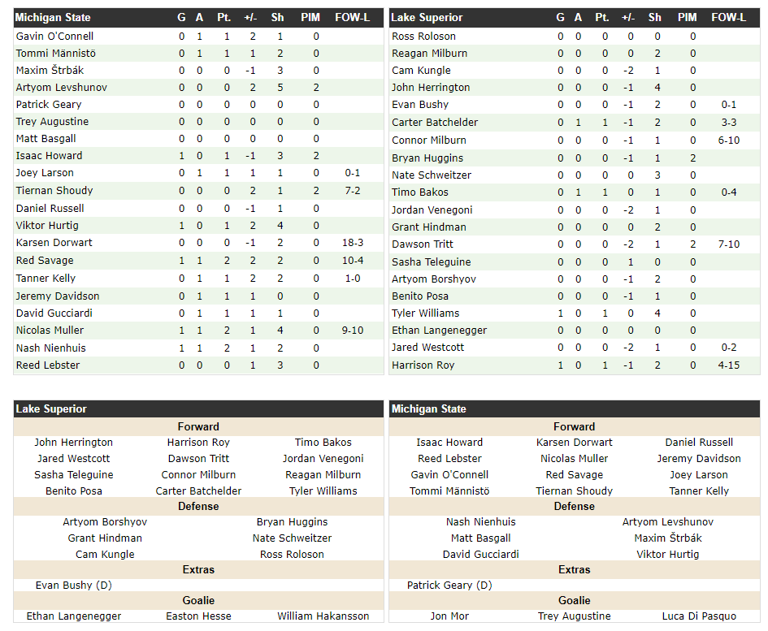

# College Hockey Statistics Project

### Table of Contents
#### Jumpright to the fun stuff
-Visualizations
1. Introduction
2. Data Source
3. Data Collection
4. Ect, ect, ect

## Introduction
This project took root during the 2022-23 college hockey season. As an alum and lifelong fan of Michigan State University, I've passionately followed the Spartans through thick and thin. The era following a decade marked by results ranging from mediocre to downright disappointing had been particularly challenging. This downturn was a stark contrast to the golden age of the 1980s and '90s. In the 15 seasons since their unexpected championship victory in 2006-07, the team had managed to qualify for the NCAA tournament only twice.

The appointment of a new head coach signaled a hopeful departure from these trends. By mid-season, it became evident that the new coaching staff was making significant strides, rekindling aspects of the program's former glory. My curiosity as a stats geek was piqued. I found myself asking: How long had it been since...? How many times had...? This project is the result of diving deep into the rabbit hole of college hockey results and statistics to find those answers.

### Data Source
The cornerstone of this project is the comprehensive dataset extracted from CollegeHockeyNews.com, the sole reliable repository for freely accessible historical college hockey results and statistics. The decision to use College Hockey News as the primary source was straightforward after navigating through their extensive 'Stats' section and historical results archive. The platform's built-in filtering and sorting tools offered a glimpse into the wealth of data available. However, to facilitate in-depth analysis and tailor the dataset to the project's needs, I decided to construct my own database, incorporating all available information from the site.
<!-- The data used in this project was extracted from CollegeHockeyNews.com using publically available information

When looking for free to access historical college hockey results and statistics if was clear there was only one viable source, College Hockey News.

Just a few clicks into exploring their 'Stats' section and historical results menu I knew this would was the place I needed to be. The built in filtering and sorting tools available on the site were helpful but I knew to do real analysis I needed to build my own database with any and all information available.  -->

## Data Collection
**Schedule & Results Page for a Single Season**
The cornerstone of data collection for this project is the Season Schedule/Results page on CollegeHockeyNews.com (CHN). CHN maintains a comprehensive page for each season within their database, extending back to the 1900-1901 season. These pages offer access to the outcomes of virtually every college hockey game played by the current Division I NCAA teams, serving as the initial step in gathering the necessary data.

**Game Box Score and Advanced Shot Metrics pages are linked from the main schedule page**
Beginning with the 2002-03 season, CollegeHockeyNews.com (CHN) began providing links to box scores for each non-exhibition game. These box scores offer a foundational level of detail about game performances, which became an integral part of the data collection process for this project.

**Game Box scores include:**
- Game Information: This section contains essential details about the game, such as the date, time, location, referees, and other relevant information.

- Linescore Section: A breakdown of goals and shots on a per-period basis, providing insight into the flow and dynamics of the game.

- Scoring Summary: A comprehensive table listing all scoring events, including assists, the game situation (e.g., 5 on 5, power play), and the time of each goal, offering a narrative of the game's key moments.

- Penalty Section: Details on each penalty called during the game, including the type of penalty, its duration, and the time it was called, highlighting the discipline or lack thereof in the game.

- Line Chart Data: Based on the line chart published by each team's coach before the game, this section provides a layout of the four forward lines (comprising three players each) and three defensive pairs, giving insight into team strategy and player utilization.

- Box Score Statistics: A traditional table of statistics for each team, including goals, assists, shots, +/- ratings, and more, providing a quantifiable measure of team and player performance.

It's important to note that the data completeness varies by season. For the seasons spanning 2003 to approximately 2012, certain sections of the game data may be missing. However, the game information, linescores, and scoring summary tables are consistently available for each game, ensuring a reliable core dataset for analysis.

Here is an example of the html box score:

#### Advanced Shot Metrics
Beginning in 2021, CollegeHockeyNews.com broadened its data offerings by introducing advanced shot metrics, ushering in a new dimension of analytics to college hockey statistics. This dataset extends beyond the standard box scores, providing a granular view of each game's shot dynamics.

The advanced shot metrics table includes the following:

- Bi: Blocked shots initiated - shots a player has taken that were blocked by the opposition
- Mi: Missed shots - shots that did not hit the target
- Sv: Shots saved by the goaltender
- G: Goals scored
- TSA: Total shot attempts - the sum of all shots taken, regardless of outcome
- BLKS: Blocked shots - shots blocked by the player's team
- FO: Faceoffs - the number of faceoffs the player has taken

The data is segmented into different gameplay situations:
- Total: Overall shot metrics for the game
- Even Strength: Shot metrics occurring during all 5 on 5 play
- Power Play: Shot metrics while the team is on a power play
- Close: even strength in one goal situations. (team is +/- 1 goal)

Example of shot metric html:

    

#### Current_Season_Scrape script
[Current_Season_Scrape Notebook](workbook/Current_season_scrape.ipynb)
In this initial Jupyter notebook, the scraping strategy is brought to life using Python tools and web scraping techniques, indicative of its role as the working draft full of explorative code and trial-and-error. The script employs BeautifulSoup and Pandas for scraping, marked by a cycle of iterative testing, debugging, and refinement.

#### Pre-2020 Box Score Scraper
[Earlier Box Score Scraper](workbook/Pre_2020_Season_Scrape.ipynb)
The "Pre_2020_Season_Scrape" notebook is a streamlined, efficient scraper for pre-2020 college hockey data, featuring robust error handling and advanced data extraction logic. This refined script is a testament to the iterative enhancement of the data collection process.

##### Data Cleaning and Stadardization
The following link to notebooks used to clean and standardize the data collected from CHN. 

-[Current Season Data Cleaning Notebook](/workbook/Current_season_DB_clean.ipynb)
-[Historical Box Score Data Cleaning Notebook](/workbook/Pre_2020_Box_Score_Clean.ipynb)
-[Standardize and Combine Individual DB Files](/workbook/DB_CORRECT_AND_TRANSFORM.ipynb)

## Roster Data

The roster data collection is detailed in the ["Roster_Scraping_Loop.ipynb"](workbook/old_books/Roster_Scraping_Loop.ipynb) notebook, which utilizes advanced Python scraping techniques to comprehensively gather roster information from the CHN database, accurately capturing the entire historical roster dataset efficently. This 8-cell notebook underscores the project's commitment to precision and thoroughness, resulting in the "all_time_combined_roster.csv" file. This dataset, meticulously cleaned and structured, serves as the foundational source for in-depth analysis and database integration.

[Download the Roster Dataset](/data/rosters/all_time_combined_roster.csv) - This link provides access to the consolidated roster data, reflecting the project's systematic approach to data collection and its readiness for analytical applications.
    

## Data Visualization

  <!-- Image 1 -->
  
  <!-- Image 2 -->
  

- Add link to Adaptive plot book

- Include some example images

## Credits and COntact Information
- Reddit - BakedMitten
- Github - JSmith1826
- LinkedIn - 